# EDGAR Platform Transformation: Parallelization Analysis

**Date**: 2025-11-29
**Researcher**: Research Agent
**Context**: Phase 2 critical path optimization
**Linear Epic**: [EDGAR → General-Purpose Platform](https://linear.app/1m-hyperdev/project/edgar-%E2%86%92-general-purpose-extract-and-transform-platform-e4cb3518b13e/issues)

---

## Executive Summary

Analysis of remaining critical path tasks reveals **5 highly parallelizable batches** that can reduce Phase 2 completion time from 15 sequential days to **6-7 parallel days** (58% time reduction).

**Key Findings**:
- ✅ **Batch 1 (Next)**: 4 independent data source migrations (can run in parallel)
- ✅ **Batch 2**: Schema analysis services (3 services, minimal cross-deps)
- ✅ **Batch 3**: Code generation pipeline (2 independent components)
- ✅ **Batch 4**: CLI framework extraction (2 independent command groups)
- ✅ **Batch 5**: Web scraping integration (independent work path)

**Maximum Parallelization**: 4 tasks can run simultaneously without conflicts

---

## Component Inventory

### Data Sources (EDGAR → Platform Migration)

| Component | Location | LOC | Status | Dependencies |
|-----------|----------|-----|--------|--------------|
| **BaseDataSource** | `edgar_analyzer/data_sources/base.py` | 36 | ✅ Migrated | None |
| **ExcelDataSource** | `edgar_analyzer/data_sources/excel_source.py` | 35 | ✅ Migrated | BaseDataSource |
| **PDFDataSource** | `edgar_analyzer/data_sources/pdf_source.py` | 79 | ✅ Migrated | BaseDataSource |
| **FileDataSource (CSV/JSON/YAML)** | `edgar_analyzer/data_sources/file_source.py` | 286 | 🔴 Pending | BaseDataSource |
| **APIDataSource** | `edgar_analyzer/data_sources/api_source.py` | 232 | 🔴 Pending | BaseDataSource |
| **URLDataSource** | `edgar_analyzer/data_sources/url_source.py` | 190 | 🔴 Pending | BaseDataSource |
| **JinaDataSource** | `edgar_analyzer/data_sources/jina_source.py` | 239 | 🔴 Pending | BaseDataSource |
| **Total Data Sources** | | **1,097 LOC** | 3/7 done | |

### Schema & Pattern Detection Services

| Component | Location | LOC | Status | Dependencies |
|-----------|----------|-----|--------|--------------|
| **SchemaAnalyzer** | `edgar_analyzer/services/schema_analyzer.py` | 432 | 🔴 Pending | patterns.py models |
| **ExampleParser** | `edgar_analyzer/services/example_parser.py` | 676 | 🔴 Pending | patterns.py, SchemaAnalyzer |
| **Pattern Models** | `edgar_analyzer/models/patterns.py` | 526 | 🔴 Pending | None (data classes) |
| **PromptGenerator** | `edgar_analyzer/services/prompt_generator.py` | ~200 | 🔴 Pending | patterns.py |
| **Total Pattern Services** | | **1,834 LOC** | 0/4 done | |

### Code Generation Pipeline

| Component | Location | LOC | Status | Dependencies |
|-----------|----------|-----|--------|--------------|
| **CodeGenerator** | `edgar_analyzer/services/code_generator.py` | 589 | 🔴 Pending | ExampleParser, Sonnet45Agent |
| **CodeValidator** | Inside code_generator.py | ~100 | 🔴 Pending | ast, plan.py models |
| **Plan Models** | `edgar_analyzer/models/plan.py` | 470 | 🔴 Pending | None (data classes) |
| **Sonnet45Agent** | `edgar_analyzer/agents/sonnet45_agent.py` | ~300 | 🔴 Pending | OpenRouter client |
| **Total Codegen** | | **1,459 LOC** | 0/4 done | |

### CLI Framework

| Component | Location | LOC | Status | Dependencies |
|-----------|----------|-----|--------|--------------|
| **Main CLI** | `edgar_analyzer/cli/main.py` | 1,384 | 🔴 Pending | Click, services |
| **Project Commands** | `edgar_analyzer/cli/commands/project.py` | 450 | 🔴 Pending | Click, data_sources |
| **Setup Commands** | `edgar_analyzer/cli/commands/setup.py` | 251 | 🔴 Pending | Click, env validation |
| **Total CLI** | | **2,085 LOC** | 0/3 done | |

### Web Scraping Work Path (NEW)

| Component | Purpose | LOC | Status | Dependencies |
|-----------|---------|-----|--------|--------------|
| **JinaDataSource** | Already counted in data sources | 239 | 🔴 Pending | BaseDataSource |
| **Web templates** | Jinja2 templates for web projects | ~50 | 🔴 New | None |
| **Web examples** | Example web scraping project | ~100 | 🔴 New | JinaDataSource |
| **Total Web Path** | | **389 LOC** | 0/3 done | |

---

## Dependency Analysis

### Dependency Graph

```mermaid
graph TD
    %% Core Base Classes (already migrated)
    BASE[BaseDataSource ✅]

    %% Data Sources Layer (Batch 1 - PARALLEL)
    FILE[FileDataSource<br/>286 LOC]
    API[APIDataSource<br/>232 LOC]
    URL[URLDataSource<br/>190 LOC]
    JINA[JinaDataSource<br/>239 LOC]

    BASE --> FILE
    BASE --> API
    BASE --> URL
    BASE --> JINA

    %% Pattern Models (Batch 2 prerequisite)
    PMODELS[Pattern Models<br/>526 LOC]
    PLANMODELS[Plan Models<br/>470 LOC]

    %% Schema Services (Batch 2 - PARALLEL)
    SCHEMA[SchemaAnalyzer<br/>432 LOC]
    PARSER[ExampleParser<br/>676 LOC]
    PROMPT[PromptGenerator<br/>~200 LOC]

    PMODELS --> SCHEMA
    PMODELS --> PARSER
    PMODELS --> PROMPT
    SCHEMA --> PARSER

    %% Code Generation (Batch 3 - PARALLEL)
    AGENT[Sonnet45Agent<br/>~300 LOC]
    CODEGEN[CodeGenerator<br/>589 LOC]
    VALIDATOR[CodeValidator<br/>~100 LOC]

    PLANMODELS --> CODEGEN
    PARSER --> CODEGEN
    AGENT --> CODEGEN
    CODEGEN --> VALIDATOR

    %% CLI Framework (Batch 4 - PARALLEL)
    PROJECT_CLI[Project Commands<br/>450 LOC]
    SETUP_CLI[Setup Commands<br/>251 LOC]
    MAIN_CLI[Main CLI<br/>1384 LOC]

    FILE --> PROJECT_CLI
    API --> PROJECT_CLI
    SCHEMA --> PROJECT_CLI
    CODEGEN --> PROJECT_CLI

    JINA --> SETUP_CLI

    PROJECT_CLI --> MAIN_CLI
    SETUP_CLI --> MAIN_CLI

    %% Web Scraping (Batch 5 - INDEPENDENT)
    WEB_TMPL[Web Templates<br/>~50 LOC]
    WEB_EX[Web Examples<br/>~100 LOC]

    JINA --> WEB_TMPL
    WEB_TMPL --> WEB_EX

    %% Styling
    classDef done fill:#90EE90,stroke:#2E8B57,stroke-width:2px
    classDef pending fill:#FFB6C1,stroke:#DC143C,stroke-width:2px
    classDef models fill:#87CEEB,stroke:#4682B4,stroke-width:2px

    class BASE done
    class FILE,API,URL,JINA,SCHEMA,PARSER,PROMPT,CODEGEN,VALIDATOR,AGENT,PROJECT_CLI,SETUP_CLI,MAIN_CLI,WEB_TMPL,WEB_EX pending
    class PMODELS,PLANMODELS models
```



### Critical Path Insights

1. **Data Sources are FULLY PARALLELIZABLE** (Batch 1)
   - All 4 depend only on BaseDataSource (already migrated)
   - No cross-dependencies between sources
   - Can run 4 simultaneous migrations

2. **Pattern Models block Schema Services** (Sequential)
   - Must migrate Pattern Models first (526 LOC)
   - Then Schema services can run in parallel

3. **Code Generation has linear dependency** (Partial parallel)
   - Agent + Plan Models can migrate together
   - CodeGenerator depends on both
   - Validator can be extracted separately

4. **CLI Framework has 2 independent groups** (Parallel)
   - Project Commands (needs data sources + schema + codegen)
   - Setup Commands (only needs Jina validation)

5. **Web Scraping is INDEPENDENT** (Can start anytime)
   - Only needs JinaDataSource (part of Batch 1)
   - Templates and examples have no other dependencies

---

## Recommended Parallelization Strategy

### **BATCH 1: Data Source Migrations** (Week 1, Days 1-2)
**Parallelization**: Run all 4 simultaneously
**Estimated Time**: 2 days (with 4 parallel tasks)
**Linear Time**: 8 days (if sequential)
**Time Saved**: 6 days (75% reduction)

| Task | Component | LOC | Assignee/Thread | Est. Hours |
|------|-----------|-----|-----------------|------------|
| **T2-A** | FileDataSource (CSV/JSON/YAML) | 286 | Thread 1 | 12h |
| **T2-B** | APIDataSource | 232 | Thread 2 | 10h |
| **T2-C** | URLDataSource | 190 | Thread 3 | 8h |
| **T2-D** | JinaDataSource | 239 | Thread 4 | 10h |

**Deliverables**:
- ✅ 4 data sources migrated to `extract_transform_platform/data_sources/`
- ✅ Unit tests migrated and passing (80%+ coverage)
- ✅ Documentation updated
- ✅ Export in `__init__.py` files

**Dependencies**: None (BaseDataSource already migrated)

**Git Strategy**: 4 separate feature branches
- `feat/migrate-file-datasource`
- `feat/migrate-api-datasource`
- `feat/migrate-url-datasource`
- `feat/migrate-jina-datasource`

---

### **BATCH 2: Pattern Models + Schema Services** (Week 1, Days 3-4)
**Phase 1**: Pattern Models (Sequential prerequisite)
**Phase 2**: Schema Services (Parallelizable)
**Estimated Time**: 2 days total
**Linear Time**: 5 days
**Time Saved**: 3 days (60% reduction)

#### Phase 1: Models Migration (Day 3 morning, 4 hours)
| Task | Component | LOC | Est. Hours |
|------|-----------|-----|------------|
| **T3-MODELS** | Pattern Models + Plan Models | 996 | 4h |

#### Phase 2: Schema Services (Day 3 afternoon + Day 4, parallel)
| Task | Component | LOC | Assignee/Thread | Est. Hours |
|------|-----------|-----|-----------------|------------|
| **T3-A** | SchemaAnalyzer | 432 | Thread 1 | 10h |
| **T3-B** | ExampleParser | 676 | Thread 2 | 14h |
| **T3-C** | PromptGenerator | ~200 | Thread 3 | 6h |

**Deliverables**:
- ✅ Pattern and Plan models in `extract_transform_platform/models/`
- ✅ Schema analysis services in `extract_transform_platform/services/`
- ✅ Unit tests for all services (75%+ coverage)
- ✅ Integration tests for pattern detection

**Dependencies**:
- Phase 1 must complete before Phase 2 starts
- Within Phase 2, all tasks are independent

**Git Strategy**:
- 1 branch for models: `feat/migrate-pattern-models`
- 3 branches for services: `feat/migrate-schema-analyzer`, `feat/migrate-example-parser`, `feat/migrate-prompt-generator`

---

### **BATCH 3: Code Generation Pipeline** (Week 1, Days 5-6)
**Parallelization**: Partial (Agent + Validator parallel, CodeGen sequential)
**Estimated Time**: 2 days
**Linear Time**: 3 days
**Time Saved**: 1 day (33% reduction)

#### Phase 1: Agent + Validator (Day 5, parallel)
| Task | Component | LOC | Assignee/Thread | Est. Hours |
|------|-----------|-----|-----------------|------------|
| **T4-A** | Sonnet45Agent | ~300 | Thread 1 | 8h |
| **T4-B** | CodeValidator | ~100 | Thread 2 | 4h |

#### Phase 2: CodeGenerator (Day 6, sequential)
| Task | Component | LOC | Est. Hours |
|------|-----------|-----|------------|
| **T4-C** | CodeGenerator | 589 | 12h |

**Deliverables**:
- ✅ Sonnet45Agent migrated to `extract_transform_platform/ai/`
- ✅ CodeValidator in `extract_transform_platform/codegen/`
- ✅ CodeGenerator in `extract_transform_platform/codegen/`
- ✅ End-to-end code generation tests
- ✅ Template system for generated code

**Dependencies**:
- T4-C requires T4-A (Agent) to complete
- T4-B (Validator) is independent but used by T4-C

**Git Strategy**:
- `feat/migrate-sonnet-agent`
- `feat/migrate-code-validator`
- `feat/migrate-code-generator` (after T4-A completes)

---

### **BATCH 4: CLI Framework** (Week 2, Days 1-2)
**Parallelization**: 2 groups (Project + Setup can run parallel initially)
**Estimated Time**: 2 days
**Linear Time**: 3 days
**Time Saved**: 1 day (33% reduction)

#### Phase 1: Command Groups (Day 1, parallel)
| Task | Component | LOC | Assignee/Thread | Est. Hours |
|------|-----------|-----|-----------------|------------|
| **T6-A** | Setup Commands | 251 | Thread 1 | 6h |
| **T6-B** | Project Commands (partial) | 450 | Thread 2 | 10h |

#### Phase 2: Main CLI Integration (Day 2, sequential)
| Task | Component | LOC | Est. Hours |
|------|-----------|-----|------------|
| **T6-C** | Main CLI + Integration | 1,384 | 10h |

**Deliverables**:
- ✅ Setup commands in `extract_transform_platform/cli/`
- ✅ Project commands in `extract_transform_platform/cli/`
- ✅ Main CLI orchestration
- ✅ Help documentation
- ✅ CLI integration tests

**Dependencies**:
- T6-A (Setup) only needs JinaDataSource validation
- T6-B (Project) needs data sources + schema + codegen
- T6-C (Main) integrates both command groups

**Git Strategy**:
- `feat/cli-setup-commands`
- `feat/cli-project-commands`
- `feat/cli-main-integration`

---

### **BATCH 5: Web Scraping Work Path** (Week 2, Days 1-2, PARALLEL with CLI)
**Parallelization**: FULLY INDEPENDENT (can run anytime after Batch 1)
**Estimated Time**: 1-2 days
**Can Run Parallel With**: Batch 4 (CLI)

| Task | Component | LOC | Est. Hours |
|------|-----------|-----|------------|
| **T5-A** | Web project templates | ~50 | 2h |
| **T5-B** | Web scraping example project | ~100 | 6h |
| **T5-C** | Web scraping documentation | - | 4h |

**Deliverables**:
- ✅ Jinja2 templates for web projects in `templates/web/`
- ✅ Example web scraping project in `projects/web_scraper/`
- ✅ Documentation: `docs/guides/WEB_SCRAPING.md`
- ✅ End-to-end test with Jina.ai

**Dependencies**:
- Only JinaDataSource (from Batch 1)
- No other dependencies

**Git Strategy**:
- `feat/web-scraping-workpath` (single branch)

---

## Parallelization Timeline

### Sequential (Without Parallelization): 15 days
```
Day 1-2:   FileDataSource
Day 3-4:   APIDataSource
Day 5-6:   URLDataSource
Day 7-8:   JinaDataSource
Day 9:     Pattern Models
Day 10-11: SchemaAnalyzer + ExampleParser + PromptGenerator
Day 12-13: Code Generation Pipeline
Day 14:    CLI Commands
Day 15:    Web Scraping
```

### Parallel (With Optimal Batching): 6-7 days ✅

```
Week 1:
  Day 1-2 (Batch 1): [FileSource || APISource || URLSource || JinaSource]
  Day 3:   (Batch 2 Phase 1): Pattern Models
           (Batch 2 Phase 2 start): [SchemaAnalyzer || ExampleParser || PromptGenerator]
  Day 4:   (Batch 2 Phase 2 complete): Schema services finish
  Day 5:   (Batch 3 Phase 1): [Sonnet45Agent || CodeValidator]
  Day 6:   (Batch 3 Phase 2): CodeGenerator

Week 2:
  Day 1-2 (Batch 4): [Setup CLI || Project CLI] → Main CLI
          (Batch 5): Web Scraping (parallel with Batch 4)
```

**Time Reduction**: 15 days → 6-7 days = **58% faster** 🎯

---

## Risk Assessment

### Technical Risks

| Risk | Impact | Probability | Mitigation |
|------|--------|-------------|------------|
| **Merge Conflicts** | High | Medium | Stagger commits, use separate directories |
| **Breaking Changes** | High | Low | Comprehensive unit tests, CI/CD checks |
| **Integration Issues** | Medium | Medium | Integration tests after each batch |
| **Dependency Drift** | Low | Low | Lock files, version pinning |

### Coordination Risks

| Risk | Impact | Probability | Mitigation |
|------|--------|-------------|------------|
| **Git Branch Complexity** | Medium | High | Clear branch naming, frequent syncs |
| **Test Overlap** | Low | Medium | Separate test files per component |
| **Documentation Lag** | Medium | High | Document as you code, PR reviews |

### Mitigation Strategies

1. **Branch Strategy**:
   - Each parallel task gets its own feature branch
   - Naming: `feat/batch{N}-{component-name}`
   - Example: `feat/batch1-api-datasource`

2. **Integration Points**:
   - End of Batch 1: Merge all data sources, run integration tests
   - End of Batch 2: Test pattern detection pipeline
   - End of Batch 3: Test end-to-end code generation
   - End of Batch 4: Test full CLI workflow

3. **Testing Strategy**:
   - Unit tests: Per component (parallel development)
   - Integration tests: Per batch (after merges)
   - E2E tests: After Batch 4 complete

4. **Communication**:
   - Daily standup: Coordinate merge windows
   - Slack/Linear updates: Batch completion status
   - PR reviews: Cross-review parallel work

---

## Execution Recommendations

### **NEXT BATCH TO EXECUTE: BATCH 1** ✅

**Start Immediately**: Data Source Migrations (4 parallel tasks)

**Recommended Assignment**:
1. **FileDataSource** (286 LOC) → Highest complexity (CSV/JSON/YAML), start first
2. **APIDataSource** (232 LOC) → Medium complexity, generic REST
3. **JinaDataSource** (239 LOC) → Medium complexity, web scraping focus
4. **URLDataSource** (190 LOC) → Lowest complexity, simple HTTP

**Branch Setup**:
```bash
# Create 4 feature branches
git checkout -b feat/batch1-file-datasource
git checkout main
git checkout -b feat/batch1-api-datasource
git checkout main
git checkout -b feat/batch1-url-datasource
git checkout main
git checkout -b feat/batch1-jina-datasource
```

**Success Criteria**:
- ✅ All 4 data sources pass unit tests (80%+ coverage)
- ✅ Integration tests validate data source factory
- ✅ Documentation updated for each source
- ✅ Clean PR reviews and merges

**Estimated Completion**: End of Day 2 (Week 1)

---

## Code Reuse Analysis

### Reuse Percentage by Component

| Component | EDGAR LOC | Platform LOC | Reuse % | Notes |
|-----------|-----------|--------------|---------|-------|
| **FileDataSource** | 286 | ~260 | 91% | Remove EDGAR-specific logic |
| **APIDataSource** | 232 | ~210 | 91% | Generic REST API wrapper |
| **URLDataSource** | 190 | ~180 | 95% | Minimal changes needed |
| **JinaDataSource** | 239 | ~230 | 96% | Already generic |
| **SchemaAnalyzer** | 432 | ~400 | 93% | Core logic reusable |
| **ExampleParser** | 676 | ~630 | 93% | Generic pattern detection |
| **CodeGenerator** | 589 | ~550 | 93% | Template-based generation |
| **Project CLI** | 450 | ~400 | 89% | Generic project management |
| **Setup CLI** | 251 | ~230 | 92% | API key setup logic |

**Overall Code Reuse**: **~92%** (exceeds 83% target) ✅

### Changes Required for Generalization

1. **Remove EDGAR-specific logic**:
   - Company CIK references
   - SEC-specific error messages
   - Fortune 500 assumptions

2. **Add abstraction layers**:
   - Data source factory pattern
   - Generic validation rules
   - Configurable field mappings

3. **Enhance configurability**:
   - Project-based config (project.yaml)
   - Environment variable support
   - Plugin architecture for custom sources

4. **Update documentation**:
   - Generic use cases (not EDGAR-specific)
   - Multiple example projects
   - Platform architecture diagrams

---

## Test Coverage Targets

### Per-Batch Coverage Goals

| Batch | Component Type | Target Coverage | Test Strategy |
|-------|----------------|-----------------|---------------|
| **Batch 1** | Data Sources | 80%+ | Unit tests per source, integration tests for factory |
| **Batch 2** | Schema Services | 75%+ | Unit tests + pattern detection integration tests |
| **Batch 3** | Code Generation | 70%+ | AST validation tests, end-to-end generation tests |
| **Batch 4** | CLI Framework | 65%+ | Command tests, integration tests for workflows |
| **Batch 5** | Web Scraping | 70%+ | Mock Jina.ai responses, E2E with real URLs |

### Testing Pyramid

```
           E2E Tests (5%)
         ___________________
        /                   \
       /  Integration (15%)  \
      /_______________________\
     /                         \
    /      Unit Tests (80%)     \
   /___________________________  \
```

---

## Long-Term Maintenance

### Post-Migration Cleanup

1. **Deprecate EDGAR-specific code** (Week 3):
   - Mark old files as deprecated
   - Add migration guides
   - Update README references

2. **Consolidate tests** (Week 3):
   - Merge duplicate test utilities
   - Create shared fixtures
   - Standardize test structure

3. **Documentation audit** (Week 4):
   - Update all CLAUDE.md references
   - Create platform migration guide
   - Add architectural decision records (ADRs)

4. **Performance benchmarking** (Week 4):
   - Benchmark data source read times
   - Profile code generation pipeline
   - Optimize hot paths

### Future Enhancements

1. **Additional Data Sources**:
   - Database sources (PostgreSQL, MySQL)
   - Cloud storage (S3, GCS)
   - Streaming sources (Kafka, RabbitMQ)

2. **Advanced Features**:
   - Caching strategies per source type
   - Parallel data extraction
   - Incremental updates

3. **Platform Features**:
   - Web UI for project management
   - Cloud deployment templates
   - Monitoring and observability

---

## Conclusion

The parallelization strategy outlined here can reduce Phase 2 completion time from **15 sequential days to 6-7 parallel days** (58% reduction).

**Immediate Next Steps**:
1. ✅ Execute Batch 1 (4 parallel data source migrations)
2. Monitor for merge conflicts and integration issues
3. Adjust timeline based on Batch 1 actual completion time
4. Prepare Batch 2 (Pattern Models + Schema Services)

**Success Metrics**:
- All batches complete within estimated timeframes
- Test coverage meets or exceeds targets
- Code reuse maintains 92%+ average
- Zero critical bugs in production migration

**Long-Term Vision**:
- Generic platform supporting 4 work paths (project, file, web, interactive)
- Extensible architecture for new data sources
- Production-ready with comprehensive test coverage
- Well-documented for external contributors

---

## Appendix: File Locations Reference

### EDGAR Source Files (To Migrate)

```
src/edgar_analyzer/
├── data_sources/
│   ├── file_source.py          (286 LOC) → platform/data_sources/file/csv_source.py
│   ├── api_source.py           (232 LOC) → platform/data_sources/web/api_source.py
│   ├── url_source.py           (190 LOC) → platform/data_sources/web/url_source.py
│   └── jina_source.py          (239 LOC) → platform/data_sources/web/jina_source.py
├── services/
│   ├── schema_analyzer.py      (432 LOC) → platform/services/schema_analyzer.py
│   ├── example_parser.py       (676 LOC) → platform/services/example_parser.py
│   ├── prompt_generator.py     (~200 LOC) → platform/ai/prompt_templates.py
│   └── code_generator.py       (589 LOC) → platform/codegen/generator.py
├── models/
│   ├── patterns.py             (526 LOC) → platform/models/transformation_pattern.py
│   └── plan.py                 (470 LOC) → platform/models/generation_plan.py
├── cli/
│   ├── main.py                 (1,384 LOC) → platform/cli/main.py
│   └── commands/
│       ├── project.py          (450 LOC) → platform/cli/commands/project.py
│       └── setup.py            (251 LOC) → platform/cli/commands/setup.py
└── agents/
    └── sonnet45_agent.py       (~300 LOC) → platform/ai/sonnet45_agent.py
```

### Platform Target Structure

```
src/extract_transform_platform/
├── core/
│   └── base.py                 (BaseDataSource, IDataExtractor)
├── data_sources/
│   ├── file/
│   │   ├── excel_source.py     ✅ Migrated
│   │   ├── pdf_source.py       ✅ Migrated
│   │   ├── csv_source.py       🔴 Pending (from file_source.py)
│   │   ├── json_source.py      🔴 Pending (from file_source.py)
│   │   └── yaml_source.py      🔴 Pending (from file_source.py)
│   └── web/
│       ├── api_source.py       🔴 Pending
│       ├── url_source.py       🔴 Pending
│       └── jina_source.py      🔴 Pending
├── services/
│   ├── schema_analyzer.py      🔴 Pending
│   ├── example_parser.py       🔴 Pending
│   └── cache_service.py        🔴 New
├── ai/
│   ├── sonnet45_agent.py       🔴 Pending
│   ├── openrouter_client.py    ✅ Migrated
│   └── prompt_templates.py     🔴 Pending
├── codegen/
│   ├── generator.py            🔴 Pending
│   └── validator.py            🔴 Pending
├── models/
│   ├── project_config.py       ✅ Migrated
│   ├── transformation_pattern.py 🔴 Pending
│   └── generation_plan.py      🔴 Pending
├── cli/
│   ├── main.py                 🔴 Pending
│   └── commands/
│       ├── project.py          🔴 Pending
│       └── setup.py            🔴 Pending
└── templates/
    ├── file/                   ✅ Exists
    │   ├── excel/
    │   └── pdf/
    └── web/                    🔴 New
        └── scraper/
```

---

**End of Analysis**
