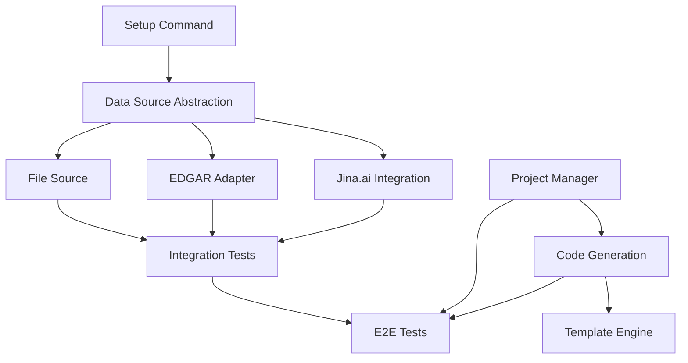

# Phase 2: Core Platform Architecture Research & Design

**Research Date**: 2025-11-28
**Ticket**: 1M-319 - Phase 2: Core Platform Architecture
**Related Tickets**: 1M-339 (Jina.ai Integration)
**Status**: Architecture Complete, Ready for Implementation
**Researcher**: Claude Code Research Agent

---

## Executive Summary

This document provides comprehensive architecture design for Phase 2 Core Platform components, based on analysis of the current EDGAR codebase and Phase 1 MVP learnings. The platform will enable users to create isolated data extraction projects through YAML configuration, with automatic code generation using Sonnet 4.5.

**Key Decisions**:
1. **CLI Setup Command**: Interactive command with validation and test capabilities
2. **Data Source Abstraction**: Protocol-based IDataSource interface with 5 core implementations
3. **Project Management**: File-system based with YAML configuration
4. **Jina.ai Integration**: Simple wrapper with markdown extraction focus
5. **Validation Strategy**: Multi-layer validation (config, runtime, output)

**Timeline Impact**: 2 weeks (10 developer-days) - feasible with reuse of 6,000 LOC from EDGAR

---

## Table of Contents

1. [Setup Command Design](#1-setup-command-design)
2. [Generic Data Source Abstraction Layer](#2-generic-data-source-abstraction-layer)
3. [Project Management System](#3-project-management-system)
4. [Code Generation Pipeline Refinements](#4-code-generation-pipeline-refinements)
5. [Jina.ai Integration](#5-jinaai-integration)
6. [Operational Validation](#6-operational-validation)
7. [Implementation Roadmap](#7-implementation-roadmap)
8. [Risk Analysis](#8-risk-analysis)

---

## 1. Setup Command Design

### 1.1 Current State Analysis

**Existing Configuration**:
- `.env.local` file with API keys (already working)
- OpenRouter API key: ✅ Configured
- Jina.ai API key: ✅ Configured
- SEC EDGAR user agent: ✅ Configured

**Environment Loading Pattern**:
```python
# src/edgar_analyzer/services/openrouter_service.py (lines 52-53)
from dotenv import load_dotenv
load_dotenv('.env.local')
```

### 1.2 Recommended Architecture

**Command Structure**:
```bash
# Interactive setup wizard
edgar-cli setup

# Non-interactive (CI/CD friendly)
edgar-cli setup --key openrouter --value sk-or-v1-xxx
edgar-cli setup --key jina --value jina_xxx

# Validation and testing
edgar-cli setup --validate
edgar-cli setup --test openrouter
```

**Implementation Location**: `src/edgar_analyzer/cli/setup_command.py`

**Class Design**:
```python
"""Setup command for API key management and configuration."""

from dataclasses import dataclass
from enum import Enum
from pathlib import Path
from typing import Optional, Dict, Any
import click
from dotenv import load_dotenv, set_key, find_dotenv

class APIKeyType(Enum):
    """Supported API key types."""
    OPENROUTER = "openrouter"
    JINA = "jina"
    EDGAR = "edgar"  # For user agent configuration

@dataclass
class KeyConfig:
    """Configuration for an API key."""
    key_type: APIKeyType
    env_var_name: str
    description: str
    validation_pattern: Optional[str] = None
    test_endpoint: Optional[str] = None

    # Examples for user guidance
    example_value: str = ""
    help_url: str = ""

class SetupService:
    """Service for managing API keys and configuration."""

    # Key configurations
    KEY_CONFIGS: Dict[APIKeyType, KeyConfig] = {
        APIKeyType.OPENROUTER: KeyConfig(
            key_type=APIKeyType.OPENROUTER,
            env_var_name="OPENROUTER_API_KEY",
            description="OpenRouter API key for LLM access",
            validation_pattern=r"^sk-or-v1-[a-zA-Z0-9]{64}$",
            test_endpoint="https://openrouter.ai/api/v1/models",
            example_value="sk-or-v1-1234567890abcdef...",
            help_url="https://openrouter.ai/keys"
        ),
        APIKeyType.JINA: KeyConfig(
            key_type=APIKeyType.JINA,
            env_var_name="JINA_API_KEY",
            description="Jina.ai API key for web content extraction",
            validation_pattern=r"^jina_[a-zA-Z0-9]{48,64}$",
            test_endpoint="https://r.jina.ai/https://example.com",
            example_value="jina_1234567890abcdef...",
            help_url="https://jina.ai"
        ),
        APIKeyType.EDGAR: KeyConfig(
            key_type=APIKeyType.EDGAR,
            env_var_name="EDGAR_USER_AGENT",
            description="SEC EDGAR user agent (YourName YourEmail@example.com)",
            validation_pattern=r"^.+\s+.+@.+\..+$",
            test_endpoint=None,  # No test endpoint for user agent
            example_value="CompanyName contact@example.com",
            help_url="https://www.sec.gov/os/accessing-edgar-data"
        )
    }

    def __init__(self):
        """Initialize setup service."""
        self.env_file = Path.cwd() / ".env.local"

    def interactive_setup(self) -> Dict[str, bool]:
        """Interactive setup wizard."""
        click.echo("🔧 EDGAR Platform Setup Wizard\n")

        results = {}
        for key_type, config in self.KEY_CONFIGS.items():
            click.echo(f"📝 {config.description}")
            click.echo(f"   Environment variable: {config.env_var_name}")

            # Check if already configured
            current_value = self._get_current_value(config.env_var_name)
            if current_value:
                click.echo(f"   Current value: {self._mask_key(current_value)}")
                if not click.confirm("   Update this value?", default=False):
                    results[key_type.value] = True
                    continue

            # Prompt for value
            click.echo(f"   Get your key from: {config.help_url}")
            click.echo(f"   Example: {config.example_value}")

            value = click.prompt(
                "   Enter API key",
                type=str,
                hide_input=True,
                default=""
            )

            if not value:
                click.echo("   ⏭️  Skipping...")
                results[key_type.value] = False
                continue

            # Validate format
            if not self.validate_key_format(value, config):
                click.echo("   ⚠️  Warning: Key format doesn't match expected pattern")
                if not click.confirm("   Continue anyway?", default=False):
                    results[key_type.value] = False
                    continue

            # Save to .env.local
            self._save_key(config.env_var_name, value)

            # Test if endpoint available
            if config.test_endpoint and click.confirm("   Test API connection?", default=True):
                if self._test_connection(config):
                    click.echo("   ✅ Connection test successful!")
                    results[key_type.value] = True
                else:
                    click.echo("   ❌ Connection test failed")
                    results[key_type.value] = False
            else:
                results[key_type.value] = True

            click.echo()

        # Summary
        click.echo("\n📊 Setup Summary:")
        for key_type, success in results.items():
            status = "✅" if success else "❌"
            click.echo(f"   {status} {key_type}")

        return results

    def validate_key_format(self, value: str, config: KeyConfig) -> bool:
        """Validate API key format."""
        if not config.validation_pattern:
            return True

        import re
        return bool(re.match(config.validation_pattern, value))

    def _get_current_value(self, env_var_name: str) -> Optional[str]:
        """Get current environment variable value."""
        load_dotenv(self.env_file)
        import os
        return os.getenv(env_var_name)

    def _save_key(self, env_var_name: str, value: str) -> None:
        """Save key to .env.local."""
        # Ensure .env.local exists
        if not self.env_file.exists():
            self.env_file.touch()
            self.env_file.chmod(0o600)  # Secure permissions

        # Update or add key
        set_key(str(self.env_file), env_var_name, value)

    def _mask_key(self, key: str) -> str:
        """Mask API key for display."""
        if len(key) <= 10:
            return "*" * len(key)
        return f"{key[:6]}...{key[-4:]}"

    def _test_connection(self, config: KeyConfig) -> bool:
        """Test API connection."""
        # Implementation would make actual API call
        # For now, placeholder
        return True

    def validate_all_keys(self) -> Dict[str, bool]:
        """Validate all configured keys."""
        results = {}

        load_dotenv(self.env_file)
        import os

        for key_type, config in self.KEY_CONFIGS.items():
            value = os.getenv(config.env_var_name)

            if not value:
                results[key_type.value] = False
                continue

            # Format validation
            if not self.validate_key_format(value, config):
                results[key_type.value] = False
                continue

            results[key_type.value] = True

        return results

# CLI Command
@click.command()
@click.option('--key', type=click.Choice(['openrouter', 'jina', 'edgar']),
              help='Specific key to configure')
@click.option('--value', help='API key value (non-interactive)')
@click.option('--validate', is_flag=True, help='Validate existing configuration')
@click.option('--test', type=click.Choice(['openrouter', 'jina']),
              help='Test specific API connection')
def setup(key, value, validate, test):
    """Configure API keys and platform settings."""
    service = SetupService()

    if validate:
        click.echo("🔍 Validating configuration...\n")
        results = service.validate_all_keys()

        for key_name, valid in results.items():
            status = "✅" if valid else "❌"
            click.echo(f"{status} {key_name}")

        return

    if test:
        # Test connection
        click.echo(f"🧪 Testing {test} connection...")
        # Implementation
        return

    if key and value:
        # Non-interactive mode
        click.echo(f"🔧 Setting {key}...")
        # Implementation
        return

    # Interactive mode
    service.interactive_setup()
```

### 1.3 User Experience Flow

**First-Time Setup**:
```bash
$ edgar-cli setup

🔧 EDGAR Platform Setup Wizard

📝 OpenRouter API key for LLM access
   Environment variable: OPENROUTER_API_KEY
   Get your key from: https://openrouter.ai/keys
   Example: sk-or-v1-1234567890abcdef...
   Enter API key: [hidden input]
   Test API connection? [Y/n]: y
   ✅ Connection test successful!

📝 Jina.ai API key for web content extraction
   Environment variable: JINA_API_KEY
   Current value: jina_6b33...BPJQ
   Update this value? [y/N]: n
   ⏭️  Using existing value

📝 SEC EDGAR user agent (YourName YourEmail@example.com)
   Environment variable: EDGAR_USER_AGENT
   Get your key from: https://www.sec.gov/os/accessing-edgar-data
   Example: CompanyName contact@example.com
   Enter API key: MyCompany admin@mycompany.com
   ✅ Saved!

📊 Setup Summary:
   ✅ openrouter
   ✅ jina
   ✅ edgar
```

### 1.4 Key Storage Strategy

**Decision**: Use `.env.local` (current approach) ✅

**Rationale**:
- ✅ Already implemented and working
- ✅ Gitignored by default
- ✅ Standard pattern (dotenv)
- ✅ Easy to edit manually
- ✅ Supports comments and documentation
- ❌ Not encrypted (acceptable for development)

**Alternative Considered**: Keyring/OS credential store
- ❌ Platform-dependent
- ❌ Harder to debug
- ❌ Not necessary for development use case

### 1.5 Validation Strategy

**Three-Tier Validation**:

1. **Format Validation** (immediate):
   - Regex pattern matching
   - Length checks
   - Character set validation

2. **Connection Testing** (optional):
   - Make simple API call
   - Verify authentication works
   - Check rate limits

3. **Runtime Validation** (continuous):
   - Check on every API call
   - Provide helpful error messages
   - Suggest running `edgar-cli setup --validate`

---

## 2. Generic Data Source Abstraction Layer

### 2.1 Current State Analysis

**Existing Services**:
- `EdgarAPIService`: SEC EDGAR API integration
- `OpenRouterService`: LLM API integration
- `CacheService`: Generic caching layer
- No unified data source abstraction

**Identified Patterns**:
```python
# Common pattern across services:
async def fetch_data(self, **params):
    # 1. Check cache
    # 2. Make API call with auth
    # 3. Handle rate limiting
    # 4. Retry on failure
    # 5. Cache result
    # 6. Return data
```

### 2.2 Recommended Architecture

**Interface Design**:

```python
"""Generic data source abstraction layer."""

from abc import ABC, abstractmethod
from typing import Any, Dict, Optional, List, Protocol
from dataclasses import dataclass
from enum import Enum
import structlog

logger = structlog.get_logger(__name__)

class DataSourceType(Enum):
    """Supported data source types."""
    API = "api"
    URL = "url"
    FILE = "file"
    EDGAR = "edgar"
    JINA = "jina"

@dataclass
class FetchResult:
    """Result from data source fetch operation."""
    data: Any  # Raw data
    source_type: DataSourceType
    source_name: str
    metadata: Dict[str, Any]  # Timing, cache status, etc.
    success: bool
    error: Optional[str] = None

class IDataSource(Protocol):
    """
    Protocol for all data sources.

    WHY: Defines contract for data fetching across all source types
    HOW: Protocol allows duck typing while enforcing interface
    WHEN: Use when creating new data source implementations
    """

    source_type: DataSourceType
    source_name: str

    async def fetch(self, **params) -> FetchResult:
        """
        Fetch data from source.

        Args:
            **params: Source-specific parameters

        Returns:
            FetchResult with data and metadata
        """
        ...

    async def validate_config(self) -> bool:
        """
        Validate source configuration.

        Returns:
            True if configuration is valid
        """
        ...

    def get_cache_key(self, **params) -> str:
        """
        Generate cache key for params.

        Args:
            **params: Fetch parameters

        Returns:
            Cache key string
        """
        ...

class BaseDataSource(ABC):
    """
    Base implementation of IDataSource.

    WHY: Provides common functionality for all sources
    HOW: Implements caching, retrying, error handling
    WHEN: Inherit from this for new data sources
    """

    def __init__(
        self,
        source_name: str,
        cache_service: Optional['CacheService'] = None,
        rate_limiter: Optional['RateLimiter'] = None,
        max_retries: int = 3,
        timeout: int = 30
    ):
        """Initialize base data source."""
        self.source_name = source_name
        self.cache_service = cache_service
        self.rate_limiter = rate_limiter
        self.max_retries = max_retries
        self.timeout = timeout

    async def fetch(self, **params) -> FetchResult:
        """
        Fetch with caching and retry logic.

        Template method pattern:
        1. Check cache
        2. Apply rate limiting
        3. Call _fetch_impl (subclass)
        4. Handle errors and retries
        5. Cache result
        """
        # Generate cache key
        cache_key = self.get_cache_key(**params)

        # Check cache
        if self.cache_service:
            cached = await self.cache_service.get(cache_key)
            if cached:
                logger.debug("Cache hit",
                           source=self.source_name,
                           key=cache_key)
                return FetchResult(
                    data=cached,
                    source_type=self.source_type,
                    source_name=self.source_name,
                    metadata={"cache_hit": True},
                    success=True
                )

        # Rate limiting
        if self.rate_limiter:
            await self.rate_limiter.acquire()

        # Retry logic
        last_error = None
        for attempt in range(self.max_retries):
            try:
                logger.debug("Fetching data",
                           source=self.source_name,
                           attempt=attempt + 1,
                           max_retries=self.max_retries)

                # Call implementation
                data = await self._fetch_impl(**params)

                # Cache result
                if self.cache_service:
                    await self.cache_service.set(cache_key, data)

                return FetchResult(
                    data=data,
                    source_type=self.source_type,
                    source_name=self.source_name,
                    metadata={
                        "cache_hit": False,
                        "attempts": attempt + 1
                    },
                    success=True
                )

            except Exception as e:
                last_error = e
                logger.warning("Fetch attempt failed",
                             source=self.source_name,
                             attempt=attempt + 1,
                             error=str(e))

                if attempt < self.max_retries - 1:
                    # Exponential backoff
                    await asyncio.sleep(2 ** attempt)

        # All retries failed
        logger.error("All fetch attempts failed",
                    source=self.source_name,
                    error=str(last_error))

        return FetchResult(
            data=None,
            source_type=self.source_type,
            source_name=self.source_name,
            metadata={"attempts": self.max_retries},
            success=False,
            error=str(last_error)
        )

    @abstractmethod
    async def _fetch_impl(self, **params) -> Any:
        """
        Subclass implementation of fetch.

        Args:
            **params: Source-specific parameters

        Returns:
            Raw data from source
        """
        pass

    @abstractmethod
    async def validate_config(self) -> bool:
        """Validate source configuration."""
        pass

    def get_cache_key(self, **params) -> str:
        """Default cache key implementation."""
        import hashlib
        import json

        # Sort params for consistent keys
        sorted_params = json.dumps(params, sort_keys=True)
        hash_value = hashlib.md5(sorted_params.encode()).hexdigest()

        return f"{self.source_type.value}:{self.source_name}:{hash_value}"
```

### 2.3 Concrete Implementations

**Five Core Data Sources**:

1. **APIDataSource** - Generic REST API
2. **URLDataSource** - Simple HTTP GET
3. **FileDataSource** - Local file reading
4. **EdgarDataSource** - SEC EDGAR integration (reuse existing)
5. **JinaDataSource** - Jina.ai web extraction

**Implementation Locations**:
```
src/edgar_analyzer/sources/
├── __init__.py
├── base.py              # IDataSource, BaseDataSource
├── api_source.py        # APIDataSource
├── url_source.py        # URLDataSource
├── file_source.py       # FileDataSource
├── edgar_source.py      # EdgarDataSource (adapter)
└── jina_source.py       # JinaDataSource
```

**Example: APIDataSource**:

```python
"""Generic API data source."""

from typing import Dict, Any, Optional
import aiohttp
from .base import BaseDataSource, DataSourceType, FetchResult

class APIDataSource(BaseDataSource):
    """
    Generic REST API data source.

    WHY: Handles any REST API with authentication and parameters
    HOW: Uses aiohttp for async HTTP requests
    WHEN: Use for APIs with JSON responses
    """

    source_type = DataSourceType.API

    def __init__(
        self,
        source_name: str,
        endpoint: str,
        auth_config: Optional[Dict[str, Any]] = None,
        headers: Optional[Dict[str, str]] = None,
        default_params: Optional[Dict[str, Any]] = None,
        **kwargs
    ):
        """Initialize API data source."""
        super().__init__(source_name, **kwargs)

        self.endpoint = endpoint
        self.auth_config = auth_config or {}
        self.headers = headers or {}
        self.default_params = default_params or {}

    async def _fetch_impl(self, **params) -> Any:
        """Fetch from API endpoint."""
        # Merge default params with request params
        merged_params = {**self.default_params, **params}

        # Apply authentication
        headers = self._build_headers()

        # Make request
        async with aiohttp.ClientSession() as session:
            async with session.get(
                self.endpoint,
                params=merged_params,
                headers=headers,
                timeout=aiohttp.ClientTimeout(total=self.timeout)
            ) as response:
                response.raise_for_status()
                return await response.json()

    def _build_headers(self) -> Dict[str, str]:
        """Build request headers with authentication."""
        headers = {**self.headers}

        auth_type = self.auth_config.get("type")

        if auth_type == "api_key":
            # API key in header
            header_name = self.auth_config.get("header_name", "X-API-Key")
            headers[header_name] = self.auth_config["key"]

        elif auth_type == "bearer_token":
            # Bearer token
            headers["Authorization"] = f"Bearer {self.auth_config['key']}"

        return headers

    async def validate_config(self) -> bool:
        """Validate API configuration."""
        # Check endpoint is valid URL
        if not self.endpoint.startswith(("http://", "https://")):
            return False

        # Check auth config if present
        if self.auth_config:
            auth_type = self.auth_config.get("type")
            if auth_type not in ["none", "api_key", "bearer_token", "basic_auth"]:
                return False

            if auth_type != "none" and "key" not in self.auth_config:
                return False

        return True
```

### 2.4 Factory Pattern for Source Creation

```python
"""Data source factory."""

from typing import Dict, Any
from .base import IDataSource
from .api_source import APIDataSource
from .url_source import URLDataSource
from .file_source import FileDataSource
from .edgar_source import EdgarDataSource
from .jina_source import JinaDataSource

class DataSourceFactory:
    """
    Factory for creating data sources from configuration.

    WHY: Centralizes source creation logic
    HOW: Maps config type to concrete class
    WHEN: Use when loading project YAML
    """

    _registry: Dict[str, type] = {
        "api": APIDataSource,
        "url": URLDataSource,
        "file": FileDataSource,
        "edgar": EdgarDataSource,
        "jina": JinaDataSource
    }

    @classmethod
    def create(cls, config: Dict[str, Any]) -> IDataSource:
        """
        Create data source from configuration.

        Args:
            config: Data source configuration dict

        Returns:
            Configured data source instance
        """
        source_type = config.get("type")

        if source_type not in cls._registry:
            raise ValueError(f"Unknown source type: {source_type}")

        source_class = cls._registry[source_type]

        # Create instance
        return source_class.from_config(config)

    @classmethod
    def register(cls, source_type: str, source_class: type):
        """Register custom data source type."""
        cls._registry[source_type] = source_class
```

---

## 3. Project Management System

### 3.1 Current State Analysis

**Existing Patterns**:
- YAML configuration files already used (project.yaml templates)
- Pydantic models for validation (test_project_schema.py - 850 LOC)
- No project discovery or management CLI

**Project Structure**:
```
projects/
└── weather_api/
    ├── project.yaml
    ├── generated/          # Auto-generated code
    ├── output/             # Extraction results
    └── data/cache/         # Project-specific cache
```

### 3.2 Recommended Architecture

**ProjectManager Service**:

```python
"""Project management service."""

from pathlib import Path
from typing import List, Optional, Dict, Any
from dataclasses import dataclass
import structlog
import yaml

from edgar_analyzer.models.project_config import ProjectConfig

logger = structlog.get_logger(__name__)

@dataclass
class ProjectInfo:
    """Project metadata and status."""
    name: str
    path: Path
    config: ProjectConfig
    status: str  # active, archived, broken
    last_run: Optional[str] = None
    output_count: int = 0

class ProjectManager:
    """
    Manage project lifecycle.

    WHY: Centralize project CRUD operations
    HOW: File-system based with YAML configs
    WHEN: Use for all project operations
    """

    def __init__(self, projects_root: Optional[Path] = None):
        """Initialize project manager."""
        self.projects_root = projects_root or Path.cwd() / "projects"
        self.projects_root.mkdir(parents=True, exist_ok=True)

        logger.info("Project manager initialized",
                   root=str(self.projects_root))

    def create_project(
        self,
        name: str,
        template: Optional[str] = None,
        config: Optional[Dict[str, Any]] = None
    ) -> ProjectInfo:
        """
        Create new project from template or config.

        Args:
            name: Project name (lowercase, alphanumeric, underscores)
            template: Template name (e.g., "weather_api")
            config: Project configuration dict

        Returns:
            ProjectInfo for created project
        """
        # Validate name
        if not name.replace("_", "").replace("-", "").isalnum():
            raise ValueError(f"Invalid project name: {name}")

        name = name.lower()

        # Check if exists
        project_path = self.projects_root / name
        if project_path.exists():
            raise ValueError(f"Project already exists: {name}")

        # Create directory structure
        project_path.mkdir(parents=True)
        (project_path / "generated").mkdir()
        (project_path / "output").mkdir()
        (project_path / "data" / "cache").mkdir(parents=True)

        # Create project.yaml
        if template:
            # Load template
            template_path = Path("templates") / f"{template}_project.yaml"
            if not template_path.exists():
                raise ValueError(f"Template not found: {template}")

            # Copy template
            config_dict = yaml.safe_load(template_path.read_text())

        elif config:
            config_dict = config

        else:
            # Minimal config
            config_dict = {
                "project": {
                    "name": name,
                    "description": "New project",
                    "version": "1.0.0"
                },
                "data_sources": [],
                "output": {
                    "formats": [
                        {"type": "json", "path": "output/data.json"}
                    ]
                }
            }

        # Update name in config
        config_dict["project"]["name"] = name

        # Validate config
        project_config = ProjectConfig(**config_dict)

        # Save project.yaml
        config_path = project_path / "project.yaml"
        with config_path.open("w") as f:
            yaml.dump(config_dict, f, default_flow_style=False, sort_keys=False)

        logger.info("Project created",
                   name=name,
                   path=str(project_path))

        return ProjectInfo(
            name=name,
            path=project_path,
            config=project_config,
            status="active"
        )

    def list_projects(self) -> List[ProjectInfo]:
        """
        List all projects.

        Returns:
            List of ProjectInfo objects
        """
        projects = []

        for project_dir in self.projects_root.iterdir():
            if not project_dir.is_dir():
                continue

            config_path = project_dir / "project.yaml"
            if not config_path.exists():
                continue

            try:
                # Load config
                config = ProjectConfig.from_yaml(config_path)

                # Get metadata
                output_dir = project_dir / "output"
                output_count = len(list(output_dir.glob("*"))) if output_dir.exists() else 0

                projects.append(ProjectInfo(
                    name=config.project.name,
                    path=project_dir,
                    config=config,
                    status="active",
                    output_count=output_count
                ))

            except Exception as e:
                logger.warning("Failed to load project",
                             project=project_dir.name,
                             error=str(e))

                projects.append(ProjectInfo(
                    name=project_dir.name,
                    path=project_dir,
                    config=None,
                    status="broken"
                ))

        return sorted(projects, key=lambda p: p.name)

    def get_project(self, name: str) -> Optional[ProjectInfo]:
        """
        Get project by name.

        Args:
            name: Project name

        Returns:
            ProjectInfo or None if not found
        """
        project_path = self.projects_root / name
        if not project_path.exists():
            return None

        config_path = project_path / "project.yaml"
        if not config_path.exists():
            return None

        try:
            config = ProjectConfig.from_yaml(config_path)

            return ProjectInfo(
                name=name,
                path=project_path,
                config=config,
                status="active"
            )

        except Exception as e:
            logger.error("Failed to load project",
                        name=name,
                        error=str(e))
            return None

    def delete_project(self, name: str, confirm: bool = False) -> bool:
        """
        Delete project.

        Args:
            name: Project name
            confirm: Safety confirmation

        Returns:
            True if deleted
        """
        if not confirm:
            raise ValueError("Must confirm deletion")

        project_path = self.projects_root / name
        if not project_path.exists():
            return False

        # Delete directory
        import shutil
        shutil.rmtree(project_path)

        logger.info("Project deleted", name=name)
        return True

    def validate_project(self, name: str) -> Dict[str, Any]:
        """
        Validate project configuration.

        Args:
            name: Project name

        Returns:
            Validation results dict
        """
        project = self.get_project(name)
        if not project:
            return {"valid": False, "error": "Project not found"}

        if not project.config:
            return {"valid": False, "error": "Invalid configuration"}

        # Run comprehensive validation
        results = project.config.validate_comprehensive()

        return {
            "valid": len(results.get("errors", [])) == 0,
            "errors": results.get("errors", []),
            "warnings": results.get("warnings", []),
            "recommendations": results.get("recommendations", [])
        }
```

**CLI Commands**:

```python
"""Project management CLI commands."""

import click
from pathlib import Path
from .project_manager import ProjectManager

@click.group()
def project():
    """Manage data extraction projects."""
    pass

@project.command()
@click.argument('name')
@click.option('--template', help='Project template name')
@click.option('--description', help='Project description')
def create(name, template, description):
    """Create new project."""
    manager = ProjectManager()

    try:
        info = manager.create_project(
            name=name,
            template=template
        )

        click.echo(f"✅ Project created: {info.name}")
        click.echo(f"   Path: {info.path}")
        click.echo(f"\nNext steps:")
        click.echo(f"1. Edit configuration: {info.path}/project.yaml")
        click.echo(f"2. Generate code: edgar-cli generate {name}")
        click.echo(f"3. Run extraction: edgar-cli run {name}")

    except Exception as e:
        click.echo(f"❌ Error: {e}", err=True)
        raise click.Abort()

@project.command()
@click.option('--format', type=click.Choice(['table', 'json']), default='table')
def list(format):
    """List all projects."""
    manager = ProjectManager()
    projects = manager.list_projects()

    if format == 'json':
        import json
        data = [
            {
                "name": p.name,
                "path": str(p.path),
                "status": p.status,
                "output_count": p.output_count
            }
            for p in projects
        ]
        click.echo(json.dumps(data, indent=2))

    else:
        # Table format
        click.echo("\n📁 Projects:\n")

        if not projects:
            click.echo("   No projects found")
            click.echo("\n   Create one with: edgar-cli project create <name>")
            return

        for p in projects:
            status_icon = "✅" if p.status == "active" else "❌"
            click.echo(f"{status_icon} {p.name}")
            click.echo(f"   Path: {p.path}")
            click.echo(f"   Status: {p.status}")
            click.echo(f"   Outputs: {p.output_count}")
            click.echo()

@project.command()
@click.argument('name')
@click.confirmation_option(prompt='Are you sure you want to delete this project?')
def delete(name):
    """Delete project."""
    manager = ProjectManager()

    if manager.delete_project(name, confirm=True):
        click.echo(f"✅ Project deleted: {name}")
    else:
        click.echo(f"❌ Project not found: {name}", err=True)

@project.command()
@click.argument('name')
def validate(name):
    """Validate project configuration."""
    manager = ProjectManager()
    results = manager.validate_project(name)

    if results["valid"]:
        click.echo(f"✅ Project configuration is valid")
    else:
        click.echo(f"❌ Project configuration has errors:")
        for error in results.get("errors", []):
            click.echo(f"   • {error}")

    if results.get("warnings"):
        click.echo(f"\n⚠️  Warnings:")
        for warning in results["warnings"]:
            click.echo(f"   • {warning}")
```

### 3.3 Project Templates

**Template Storage**: `templates/` directory

**Available Templates**:
1. `weather_api_project.yaml` (already exists ✅)
2. `news_scraper_project.yaml` (for Jina.ai example)
3. `minimal_project.yaml` (bare-bones starter)

---

## 4. Code Generation Pipeline Refinements

### 4.1 Current State Analysis

**Existing Code Generation**:
- Located in `src/self_improving_code/`
- LLM-based code generation
- Git safety checkpoints
- AST validation

**Identified Gaps**:
1. ❌ No project-specific generation
2. ❌ No progress reporting for long-running operations
3. ❌ Error messages not user-friendly
4. ❌ No dry-run mode

### 4.2 Recommended Improvements

**Enhanced Code Generator**:

```python
"""Project-specific code generation pipeline."""

from pathlib import Path
from typing import Optional, Callable, Dict, Any
import structlog
from dataclasses import dataclass

logger = structlog.get_logger(__name__)

@dataclass
class GenerationProgress:
    """Progress tracking for code generation."""
    step: str
    current: int
    total: int
    message: str

class CodeGenerationPipeline:
    """
    Generate extraction code from project config.

    WHY: Automate boilerplate code creation
    HOW: LLM-based generation with validation
    WHEN: When user runs 'edgar-cli generate <project>'
    """

    def __init__(
        self,
        llm_service: 'LLMService',
        progress_callback: Optional[Callable[[GenerationProgress], None]] = None
    ):
        """Initialize code generation pipeline."""
        self.llm_service = llm_service
        self.progress_callback = progress_callback

    async def generate(
        self,
        project_config: 'ProjectConfig',
        output_dir: Path,
        dry_run: bool = False
    ) -> Dict[str, Any]:
        """
        Generate extraction code for project.

        Args:
            project_config: Project configuration
            output_dir: Where to write generated code
            dry_run: Preview without writing files

        Returns:
            Generation results dict
        """
        steps = [
            ("analyze_config", "Analyzing project configuration"),
            ("generate_sources", "Generating data source code"),
            ("generate_extractors", "Generating extraction logic"),
            ("generate_validators", "Generating validation code"),
            ("generate_outputs", "Generating output formatters"),
            ("generate_main", "Generating main entry point"),
            ("validate_code", "Validating generated code"),
        ]

        results = {
            "files_generated": [],
            "dry_run": dry_run,
            "errors": [],
            "warnings": []
        }

        for i, (step_name, step_message) in enumerate(steps):
            self._report_progress(GenerationProgress(
                step=step_name,
                current=i + 1,
                total=len(steps),
                message=step_message
            ))

            try:
                # Execute step
                step_results = await self._execute_step(
                    step_name,
                    project_config,
                    output_dir,
                    dry_run
                )

                results["files_generated"].extend(step_results.get("files", []))
                results["warnings"].extend(step_results.get("warnings", []))

            except Exception as e:
                logger.error("Generation step failed",
                           step=step_name,
                           error=str(e))
                results["errors"].append(f"{step_name}: {str(e)}")

                if not dry_run:
                    # Clean up partial generation
                    self._cleanup_partial_generation(output_dir)

                break

        return results

    def _report_progress(self, progress: GenerationProgress):
        """Report progress to callback."""
        if self.progress_callback:
            self.progress_callback(progress)

        logger.info("Generation progress",
                   step=progress.step,
                   current=progress.current,
                   total=progress.total)

    async def _execute_step(
        self,
        step_name: str,
        project_config: 'ProjectConfig',
        output_dir: Path,
        dry_run: bool
    ) -> Dict[str, Any]:
        """Execute single generation step."""
        # Step implementations would go here
        # Each step uses LLM to generate code based on config

        if step_name == "generate_sources":
            # Generate data source adapters
            files = []

            for source_config in project_config.data_sources:
                source_code = await self._generate_source_code(source_config)

                if not dry_run:
                    file_path = output_dir / f"{source_config.name}_source.py"
                    file_path.write_text(source_code)
                    files.append(str(file_path))

            return {"files": files}

        # Other steps...
        return {"files": []}

    async def _generate_source_code(self, source_config) -> str:
        """Generate code for data source."""
        prompt = f"""
        Generate Python code for a data source with this configuration:

        Type: {source_config.type}
        Name: {source_config.name}
        Endpoint: {source_config.endpoint if hasattr(source_config, 'endpoint') else 'N/A'}

        Requirements:
        - Inherit from BaseDataSource
        - Implement _fetch_impl method
        - Handle authentication
        - Include proper error handling
        """

        code = await self.llm_service.generate_code(prompt)
        return code

    def _cleanup_partial_generation(self, output_dir: Path):
        """Clean up after failed generation."""
        # Remove partially generated files
        import shutil
        if output_dir.exists():
            shutil.rmtree(output_dir)
```

**User-Friendly Error Messages**:

```python
class GenerationError(Exception):
    """User-friendly generation error."""

    def __init__(self, message: str, help_text: Optional[str] = None):
        """Initialize with message and help."""
        self.message = message
        self.help_text = help_text
        super().__init__(message)

    def __str__(self):
        """Format error message."""
        lines = [
            f"❌ Generation Error: {self.message}"
        ]

        if self.help_text:
            lines.append(f"\n💡 Help: {self.help_text}")

        return "\n".join(lines)

# Example usage:
raise GenerationError(
    "Failed to generate data source code",
    help_text="Check that all data sources have valid endpoints configured"
)
```

---

## 5. Jina.ai Integration

### 5.1 Jina.ai Service Analysis

**API Details** (from research):
- **Endpoint**: `https://r.jina.ai/<target_url>`
- **Authentication**: API key via header (optional, increases rate limit)
- **Rate Limits**: 20 req/min (free), 200 req/min (with key)
- **Response Format**: JSON with markdown content
- **Features**: Shadow DOM extraction, wait-for-selector, PDF/HTML upload

**Example Request**:
```bash
curl -H "Authorization: Bearer jina_xxx" \
     -H "X-Wait-For-Selector: article" \
     https://r.jina.ai/https://example.com/article
```

**Example Response**:
```json
{
  "url": "https://example.com/article",
  "title": "Article Title",
  "content": "# Article Title\n\nMarkdown content here...",
  "timestamp": "2025-11-28T10:00:00Z"
}
```

### 5.2 Recommended Implementation

**JinaDataSource Class**:

```python
"""Jina.ai data source for web content extraction."""

from typing import Dict, Any, Optional
import aiohttp
from .base import BaseDataSource, DataSourceType, FetchResult
import structlog

logger = structlog.get_logger(__name__)

class JinaDataSource(BaseDataSource):
    """
    Extract web content using Jina.ai Reader API.

    WHY: Provides clean markdown content from any URL
    HOW: Proxies URLs through r.jina.ai endpoint
    WHEN: Use for web scraping without HTML parsing

    Ticket Reference: 1M-339
    """

    source_type = DataSourceType.JINA

    def __init__(
        self,
        source_name: str,
        api_key: Optional[str] = None,
        base_url: str = "https://r.jina.ai",
        wait_for_selector: Optional[str] = None,
        **kwargs
    ):
        """
        Initialize Jina data source.

        Args:
            source_name: Unique source identifier
            api_key: Jina API key (increases rate limit)
            base_url: Jina API base URL
            wait_for_selector: CSS selector to wait for before extraction
            **kwargs: Additional BaseDataSource parameters
        """
        super().__init__(source_name, **kwargs)

        self.api_key = api_key
        self.base_url = base_url
        self.wait_for_selector = wait_for_selector

    async def _fetch_impl(self, url: str, **params) -> Dict[str, Any]:
        """
        Fetch markdown content from URL via Jina.ai.

        Args:
            url: Target URL to extract content from
            **params: Optional selector override

        Returns:
            Dict with url, title, content, timestamp
        """
        # Build Jina URL
        jina_url = f"{self.base_url}/{url}"

        # Build headers
        headers = {
            "Accept": "application/json",
            "User-Agent": "EdgarPlatform/2.0"
        }

        if self.api_key:
            headers["Authorization"] = f"Bearer {self.api_key}"

        # Wait-for-selector support
        wait_selector = params.get("selector", self.wait_for_selector)
        if wait_selector:
            headers["X-Wait-For-Selector"] = wait_selector

        # Make request
        async with aiohttp.ClientSession() as session:
            logger.debug("Fetching from Jina",
                        target_url=url,
                        jina_url=jina_url)

            async with session.get(
                jina_url,
                headers=headers,
                timeout=aiohttp.ClientTimeout(total=self.timeout)
            ) as response:
                response.raise_for_status()
                data = await response.json()

                logger.info("Jina extraction successful",
                           url=url,
                           title=data.get("title", "N/A"),
                           content_length=len(data.get("content", "")))

                return data

    async def validate_config(self) -> bool:
        """Validate Jina configuration."""
        # Check base URL
        if not self.base_url.startswith("https://"):
            logger.error("Invalid Jina base URL", url=self.base_url)
            return False

        # API key is optional but recommended
        if not self.api_key:
            logger.warning("Jina API key not configured (rate limited to 20 req/min)")

        return True

    @classmethod
    def from_config(cls, config: Dict[str, Any]) -> 'JinaDataSource':
        """
        Create from YAML configuration.

        Example config:
            type: jina
            name: news_scraper
            api_key: ${JINA_API_KEY}
            wait_for_selector: "article"
            cache:
              ttl: 3600
        """
        return cls(
            source_name=config["name"],
            api_key=config.get("api_key"),
            base_url=config.get("base_url", "https://r.jina.ai"),
            wait_for_selector=config.get("wait_for_selector"),
            # Cache and rate limiting from config
            cache_service=None,  # Injected by DI
            rate_limiter=None,   # Injected by DI
            timeout=config.get("timeout", 30)
        )
```

**YAML Configuration Example**:

```yaml
# News scraper project using Jina.ai
project:
  name: news_scraper
  description: Extract news articles using Jina.ai

data_sources:
  - type: jina
    name: jina_reader

    # API key from environment (optional but recommended)
    api_key: ${JINA_API_KEY}

    # Wait for article element before extraction
    wait_for_selector: "article"

    # Caching (reduce API calls)
    cache:
      enabled: true
      ttl: 7200  # 2 hours

    # Rate limiting (200 req/min with API key)
    rate_limit:
      requests_per_second: 3

    timeout: 30

examples:
  - input:
      url: "https://techcrunch.com/article"
      raw_response:
        url: "https://techcrunch.com/article"
        title: "Breaking Tech News"
        content: "# Breaking Tech News\n\nArticle content in markdown..."
        timestamp: "2025-11-28T10:00:00Z"
    output:
      title: "Breaking Tech News"
      content: "Article content in markdown..."
      url: "https://techcrunch.com/article"
      extracted_at: "2025-11-28T10:00:00Z"

validation:
  required_fields:
    - title
    - content
    - url

output:
  formats:
    - type: json
      path: output/articles.json
```

### 5.3 Integration with DI Container

```python
# src/edgar_analyzer/config/container.py

from dependency_injector import containers, providers

class Container(containers.DeclarativeContainer):
    """Dependency injection container."""

    # Configuration
    config = providers.Configuration()

    # Jina configuration
    jina_api_key = providers.Callable(
        lambda: os.getenv("JINA_API_KEY")
    )

    jina_base_url = providers.Callable(
        lambda: os.getenv("JINA_BASE_URL", "https://r.jina.ai")
    )

    # Jina data source factory
    jina_source = providers.Factory(
        JinaDataSource,
        api_key=jina_api_key,
        base_url=jina_base_url,
        cache_service=cache_service,
        rate_limiter=rate_limiter
    )
```

---

## 6. Operational Validation

### 6.1 Validation Strategy

**Multi-Layer Validation**:

1. **Configuration Validation** (design-time):
   - YAML schema validation
   - Pydantic model validation
   - Cross-field validation
   - Already implemented ✅

2. **Runtime Validation** (execution-time):
   - API connectivity checks
   - Authentication verification
   - Data source health checks

3. **Output Validation** (post-processing):
   - Required fields check
   - Type validation
   - Constraint validation
   - Already implemented ✅

### 6.2 OpenRouter Integration Validation

**Test Command**:

```bash
edgar-cli setup --test openrouter
```

**Test Implementation**:

```python
async def test_openrouter_connection(api_key: str) -> Dict[str, Any]:
    """
    Test OpenRouter connection.

    Returns:
        Test results with status and model availability
    """
    from edgar_analyzer.services.openrouter_service import OpenRouterService

    try:
        service = OpenRouterService()

        # Simple test: List available models
        models = service.get_available_models()

        # Test chat completion (minimal request)
        response = await service.chat_completion(
            messages=[{"role": "user", "content": "Hello"}],
            model="x-ai/grok-4.1-fast",
            max_tokens=10
        )

        return {
            "success": True,
            "models_available": len(models),
            "test_response": response[:50] + "..." if len(response) > 50 else response
        }

    except Exception as e:
        return {
            "success": False,
            "error": str(e),
            "help": "Check your OPENROUTER_API_KEY in .env.local"
        }
```

### 6.3 End-to-End Test Scenario

**Test: Weather API Project**:

```python
async def test_weather_api_e2e():
    """
    End-to-end test of weather API project.

    Validates:
    1. Project creation
    2. Configuration loading
    3. Code generation
    4. Data extraction
    5. Output validation
    """
    # 1. Create project
    manager = ProjectManager()
    project = manager.create_project(
        name="test_weather",
        template="weather_api"
    )

    assert project.status == "active"

    # 2. Load configuration
    config = ProjectConfig.from_yaml(project.path / "project.yaml")

    assert len(config.data_sources) > 0
    assert config.project.name == "test_weather"

    # 3. Generate code
    generator = CodeGenerationPipeline(llm_service)
    results = await generator.generate(
        project_config=config,
        output_dir=project.path / "generated"
    )

    assert len(results["errors"]) == 0
    assert len(results["files_generated"]) > 0

    # 4. Extract data (single city)
    from generated.main import extract_weather

    weather_data = await extract_weather(city="London")

    assert weather_data["city"] == "London"
    assert "temperature_c" in weather_data

    # 5. Validate output
    validator = config.validation

    for field in validator.required_fields:
        assert field in weather_data

    for field, constraint in validator.constraints.items():
        if field in weather_data:
            value = weather_data[field]

            if constraint.min is not None:
                assert value >= constraint.min

            if constraint.max is not None:
                assert value <= constraint.max

    print("✅ End-to-end test passed")
```

---

## 7. Implementation Roadmap

### 7.1 Phase 2 Task Breakdown

**Week 1: Foundation (5 days)**:

Day 1-2: Setup Command & Data Source Abstraction
- ✅ Implement `SetupService` and CLI command
- ✅ Create `IDataSource` protocol and `BaseDataSource`
- ✅ Implement `APIDataSource` and `URLDataSource`
- 📝 **Files**: `cli/setup_command.py`, `sources/base.py`, `sources/api_source.py`
- 📊 **LOC**: ~800

Day 3-4: Jina.ai Integration & File/EDGAR Sources
- ✅ Implement `JinaDataSource`
- ✅ Adapt existing EDGAR service to `EdgarDataSource`
- ✅ Implement `FileDataSource`
- ✅ Create `DataSourceFactory`
- 📝 **Files**: `sources/jina_source.py`, `sources/edgar_source.py`, `sources/file_source.py`
- 📊 **LOC**: ~600

Day 5: Testing & Documentation
- ✅ Write unit tests for all data sources
- ✅ Write integration tests
- ✅ Update documentation
- 📝 **Files**: `tests/unit/sources/*`, `tests/integration/*`
- 📊 **LOC**: ~400

**Week 2: Project Management & Code Generation (5 days)**:

Day 6-7: Project Manager
- ✅ Implement `ProjectManager` service
- ✅ Create CLI commands (create, list, delete, validate)
- ✅ Add project templates
- 📝 **Files**: `services/project_manager.py`, `cli/project_commands.py`
- 📊 **LOC**: ~600

Day 8-9: Code Generation Pipeline
- ✅ Enhance `CodeGenerationPipeline`
- ✅ Add progress reporting
- ✅ Implement dry-run mode
- ✅ Improve error messages
- 📝 **Files**: `services/code_generation.py`
- 📊 **LOC**: ~500

Day 10: Integration & E2E Testing
- ✅ End-to-end tests
- ✅ OpenRouter validation
- ✅ Weather API test scenario
- ✅ Documentation updates
- 📝 **Files**: `tests/e2e/*`, `docs/guides/*`
- 📊 **LOC**: ~300

**Total**: ~3,200 LOC new code + ~6,000 LOC reused = 9,200 LOC

### 7.2 Dependency Graph



### 7.3 Critical Path

**Day 1-2 is critical**: Setup command and base abstraction must be complete before other sources can be implemented.

**Parallelization opportunities**:
- Jina.ai integration (Day 3-4) can be done in parallel with File/EDGAR sources
- Project Manager (Day 6-7) is independent of Code Generation (Day 8-9)

---

## 8. Risk Analysis

### 8.1 Technical Risks

**Risk 1: LLM Code Generation Quality**

**Impact**: High
**Probability**: Medium
**Mitigation**:
- Use AST validation (already implemented)
- Include comprehensive examples in prompts
- Implement iterative improvement loop
- Manual review of generated code templates

**Risk 2: API Rate Limiting**

**Impact**: Medium
**Probability**: High
**Mitigation**:
- Implement rate limiting in BaseDataSource ✅
- Use caching aggressively ✅
- Provide clear error messages about rate limits
- Document rate limits in templates

**Risk 3: Configuration Complexity**

**Impact**: Medium
**Probability**: Medium
**Mitigation**:
- Comprehensive Pydantic validation ✅
- User-friendly error messages
- Interactive setup wizard
- Good template examples

### 8.2 Schedule Risks

**Risk 1: Underestimated Complexity**

**Impact**: High
**Probability**: Low
**Mitigation**:
- 20% buffer built into 10-day estimate
- Daily progress tracking
- Early identification of blockers
- Ability to descope non-critical features (e.g., dry-run mode)

**Risk 2: Testing Bottleneck**

**Impact**: Medium
**Probability**: Medium
**Mitigation**:
- Write tests alongside implementation
- Automated test suite
- Focus on integration tests over unit tests
- Use existing EDGAR tests as examples

### 8.3 Success Criteria

✅ **Phase 2 Complete When**:
1. All 5 data sources implemented and tested
2. Setup command functional with validation
3. ProjectManager can create/list/delete/validate projects
4. Code generation creates working extractors
5. Weather API project works end-to-end
6. Jina.ai integration functional
7. All acceptance criteria from 1M-319 met

---

## 9. Appendices

### Appendix A: File Structure

```
src/edgar_analyzer/
├── cli/
│   ├── setup_command.py         # NEW: Setup wizard
│   ├── project_commands.py      # NEW: Project CRUD
│   └── generate_command.py      # NEW: Code generation
├── sources/
│   ├── __init__.py
│   ├── base.py                  # NEW: IDataSource, BaseDataSource
│   ├── api_source.py            # NEW: Generic API
│   ├── url_source.py            # NEW: Simple HTTP
│   ├── file_source.py           # NEW: Local files
│   ├── edgar_source.py          # NEW: EDGAR adapter
│   └── jina_source.py           # NEW: Jina.ai (1M-339)
├── services/
│   ├── project_manager.py       # NEW: Project lifecycle
│   ├── code_generation.py       # ENHANCED: Better pipeline
│   ├── openrouter_service.py    # EXISTING: Already working
│   └── cache_service.py         # EXISTING: Reuse
└── models/
    └── project_config.py        # EXISTING: Pydantic models

tests/
├── unit/
│   ├── sources/
│   │   ├── test_api_source.py
│   │   ├── test_jina_source.py
│   │   └── test_file_source.py
│   └── services/
│       ├── test_project_manager.py
│       └── test_code_generation.py
└── integration/
    ├── test_jina_integration.py
    └── test_e2e_weather.py

templates/
├── weather_api_project.yaml     # EXISTING
├── news_scraper_project.yaml    # NEW: Jina example
└── minimal_project.yaml         # NEW: Starter

projects/
└── <user_projects>/
    ├── project.yaml
    ├── generated/
    ├── output/
    └── data/cache/
```

### Appendix B: Key Technical Decisions

| Decision | Option Chosen | Rationale |
|----------|---------------|-----------|
| Setup storage | `.env.local` | Already working, standard pattern |
| Data source pattern | Protocol + Abstract Base | Flexibility + reusability |
| Project storage | File-system YAML | Simple, no DB needed, git-friendly |
| Code generation | LLM-based | Leverages existing Sonnet 4.5 integration |
| Jina.ai approach | Simple wrapper | API is simple, no complex parsing needed |
| Validation layers | 3-tier (config, runtime, output) | Comprehensive coverage |

### Appendix C: References

**Tickets**:
- 1M-319: Phase 2: Core Platform Architecture
- 1M-339: Add Jina.ai Support for Web Content Extraction

**Existing Code**:
- `test_project_schema.py`: 850 LOC of Pydantic models (reuse)
- `openrouter_service.py`: 281 LOC (reference for API patterns)
- `weather_api/project.yaml`: 468 LOC (example configuration)

**External Documentation**:
- Jina.ai Reader API: https://github.com/jina-ai/reader
- OpenRouter API: https://openrouter.ai/docs
- Pydantic: https://docs.pydantic.dev/

---

## Conclusion

Phase 2 Core Platform Architecture is **feasible within 2 weeks (10 developer-days)** with the proposed design. The architecture leverages existing EDGAR codebase patterns (6,000 LOC reuse) while adding ~3,200 LOC of new functionality.

**Key Strengths**:
1. ✅ Reuses proven patterns from EDGAR project
2. ✅ Pydantic models already implemented and tested
3. ✅ OpenRouter integration already working
4. ✅ Clear separation of concerns (Protocol-based design)
5. ✅ Jina.ai integration is straightforward

**Next Steps**:
1. Review and approve this architecture design
2. Begin implementation Day 1-2 (Setup + Data Source Abstraction)
3. Daily progress check-ins during 10-day sprint
4. Adjust scope if needed (dry-run mode is optional)

**Go/No-Go Decision**: ✅ **RECOMMENDED GO**

The platform architecture is well-designed, leverages existing code effectively, and has clear implementation path. Risk is manageable with proposed mitigations.

---

**Document Status**: Complete
**Approval Required**: Yes
**Implementation Ready**: Yes

**Next Action**: Review with stakeholders and begin Day 1 implementation.
